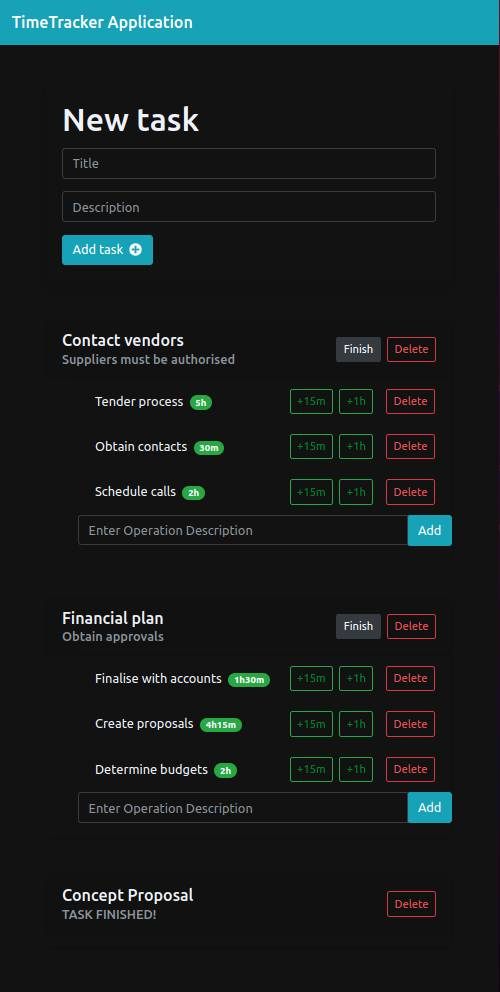

# Important information

The purpose of this project is to communicate with an API to allow you to retrieve, create and ammend
task and operation. It allows you to increase time required for each task.

This is a very simple application with potential to build upon to communicate with a database.

API host information has been removed due to privacy! As well as the API key!
For project to work, you will need to configure and connect to a server at the top of script.js file.

Screenshot of application below:

